# CEB v1 State Machine

**Boundary:** Controlled Evaluation Boundary v1  
**Document type:** Governance — Formal State Transition Model  
**Date:** 2026-06-30  
**CEB v1 cycle:** **CLOSED**  
**Current operational states:** `AUTHORIZATION_READY_FOR_BUILD` · `REQUIRES_DESIGN_DECISION` (concurrent; whitelist pending)

---

## 1. Design Principles

1. **Governance precedes execution** — state transitions require documented evidence, not implicit progress.
2. **Non-execution is valid** — remaining in `REQUIRES_DESIGN_DECISION` or `AUTHORIZATION_READY_FOR_BUILD` without building is correct when preconditions are unmet.
3. **No state skipping** — direct transition to `APPROVED_FOR_DELIVERY` from any pre-review state is prohibited.
4. **Human approval is orthogonal to automation** — gate exit 0 and V2 audit review are necessary but not sufficient for delivery.
5. **Concurrent blocking states permitted** — authorization model completeness does not imply whitelist finalization.

---

## 2. State Inventory

| State | Type | Meaning | Delivery permitted? |
|-------|------|---------|---------------------|
| `DRAFT` | Transient | Pre-freeze design; decisions mutable | No |
| `DESIGN_READY_FOR_BUILD` | Milestone | D-1..D-5 frozen; design decisions documented | No |
| `REQUIRES_DESIGN_DECISION` | **Blocking** | Whitelist, scope, or OQ unresolved; build blocked | No |
| `AUTHORIZATION_READY_FOR_BUILD` | Milestone | Authorization model complete; OQ-2/OQ-6 closed | No |
| `BUILD_IN_PROGRESS` | Transient | Clean-room active; evidence accumulating | No |
| `BUILD_VALIDATED` | Milestone | Manifests generated; BUILD_RECORD complete | No |
| `READY_FOR_EXTERNAL_REVIEW` | Milestone | Gate exit 0 + V2 without blockers | No (review only) |
| `APPROVED_FOR_DELIVERY` | Terminal (success) | SRO sign-off + APPROVAL_RECORD complete | **Yes** |
| `BLOCKED_PENDING_REMEDIATION` | Terminal (block) | Control failure; remediation required | No |

---

## 3. State Diagram

```mermaid
stateDiagram-v2
    [*] --> DRAFT
    DRAFT --> DESIGN_READY_FOR_BUILD : D-1..D-5 frozen
    DESIGN_READY_FOR_BUILD --> REQUIRES_DESIGN_DECISION : whitelist absent / OQ unresolved
    DESIGN_READY_FOR_BUILD --> AUTHORIZATION_READY_FOR_BUILD : authorization model complete
    REQUIRES_DESIGN_DECISION --> BUILD_IN_PROGRESS : whitelist finalized + OQ-1 closed
    AUTHORIZATION_READY_FOR_BUILD --> BUILD_IN_PROGRESS : Phase 1 complete; gates permit
    BUILD_IN_PROGRESS --> BUILD_VALIDATED : manifests generated
    BUILD_VALIDATED --> READY_FOR_EXTERNAL_REVIEW : gate exit 0 + V2 pass
    READY_FOR_EXTERNAL_REVIEW --> APPROVED_FOR_DELIVERY : SRO approval
    BUILD_IN_PROGRESS --> BLOCKED_PENDING_REMEDIATION : control failure
    BUILD_VALIDATED --> BLOCKED_PENDING_REMEDIATION : gate/audit failure
    READY_FOR_EXTERNAL_REVIEW --> BLOCKED_PENDING_REMEDIATION : identity divergence
    BLOCKED_PENDING_REMEDIATION --> BUILD_IN_PROGRESS : remediation + new Release ID
```



---

## 4. Current State Semantics (2026-06-30)

### 4.1 CEB v1 CLOSED

The CEB v1 **design freeze cycle** is closed. Decisions D-1 through D-5 are recorded in [`DESIGN_DECISIONS.md`](./DESIGN_DECISIONS.md). No further design mutations occur under CEB v1 identity without a new Release ID.

### 4.2 Concurrent States

| State | Rationale |
|-------|-----------|
| `AUTHORIZATION_READY_FOR_BUILD` | OQ-2 (SRO) and OQ-6 (Option A) closed; authorization model complete; Phase 1 executed |
| `REQUIRES_DESIGN_DECISION` | Whitelist file enumeration **pending**; OQ-1 (identity) **OPEN** |

Both states coexist legitimately: authorization to *prepare* does not imply authorization to *assemble full partner package* or *deliver*.

### 4.3 Phase 1 Outcome

Phase 1 clean-room preparation **executed** (2026-06-30). Contractual skeleton staged in isolated workspace. No compilation, binaries, or ZIP. **Non-execution is the governance-correct outcome** for remaining pipeline phases under Option A with open OQs.

---

## 5. REQUIRES_DESIGN_DECISION — Semantics

### 5.1 Definition

A first-class blocking state indicating that automated or operational progress must halt because required human design input cannot be derived from policy, tooling, or inference.

### 5.2 Active Triggers (2026-06-30)

| Trigger | Status |
|---------|--------|
| Whitelist not finalized | **ACTIVE** |
| OQ-1 (identity) open | **ACTIVE** |
| OQ-6 unresolved | Resolved (Option A) |

### 5.3 Valid Behaviors While Blocked

| Behavior | Valid? |
|----------|--------|
| Remain blocked indefinitely | **Yes** |
| Execute recursive repo copy | **No — prohibited** |
| Ship legacy blocked artifact | **No — prohibited** |
| Document research-only package | **Yes** |
| Request SRO decision on OQs | **Yes — required** |

---

## 6. Transition Preconditions

| Target state | Minimum preconditions |
|--------------|----------------------|
| `BUILD_IN_PROGRESS` | Whitelist finalized; OQ-1 closed; SRO authorization |
| `BUILD_VALIDATED` | SHA256 manifest; RELEASE_MANIFEST; BUILD_RECORD complete |
| `READY_FOR_EXTERNAL_REVIEW` | Gate exit 0; V2 without CRITICAL/HIGH blockers |
| `APPROVED_FOR_DELIVERY` | Complete APPROVAL_RECORD; all delivery OQs resolved or waived by SRO |

---

## 7. V2 Review Integration

Adversarial Audit V2 **review completed** (2026-06-30). Criteria FC-01 through FC-25 frozen. Artifact-dependent criteria remain `PENDING` until build/ZIP exists — expected under Option A non-execution posture.

V2 review completion validates protocol readiness; it does not advance state machine beyond current concurrent states without whitelist and OQ-1 closure.

---

## 8. Closure Statement

```
CEB_V1_STATE_MACHINE
CYCLE_STATUS              = CLOSED
OPERATIONAL_STATES        = AUTHORIZATION_READY_FOR_BUILD + REQUIRES_DESIGN_DECISION
PHASE_1                   = EXECUTED
V2_REVIEW                 = COMPLETED
WHITELIST                 = PENDING
DELIVERY_AUTHORIZED       = NO
NON_EXECUTION             = VALID SECURITY STATE
```

---

_CEB v1 State Machine — 2026-06-30_
